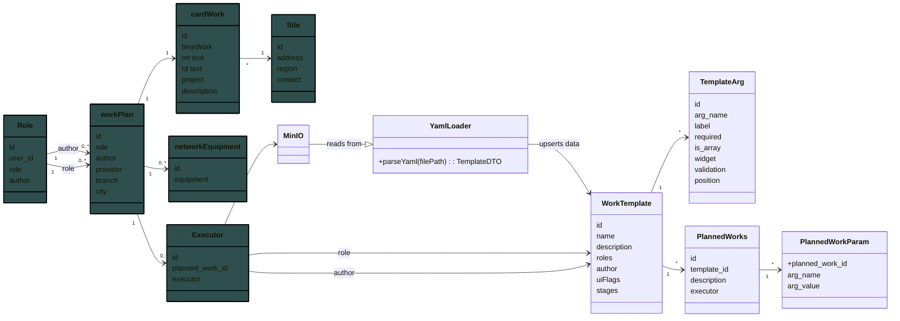

# Схема данных

```mermaid
classDiagram
direction LR

    class Role {
        id 
        user_id
        role 
        author
    }

    class workPlan {
        id
        role 
        author
        provider 
        branch 
        city 
    }

    class cardWork {
        id
        timeWork
        rm text
        rd text
        project 
        description 
    }

    class networkEquipment {
        id
        equipment 
    }

    class Executor {
        id
        planned_work_id 
        executor
    }

    class WorkTemplate {
        id 
        name 
        description 
        roles 
        author
        uiFlags 
        stages 
    }

    class TemplateArg {
        id 
        arg_name 
        label 
        required 
        is_array 
        widget 
        validation 
        position
    }

    class YamlLoader {
        +parseYaml(filePath): TemplateDTO
    }

    class PlannedWorks {
        id 
        template_id 
        description 
        executor
    }

    class PlannedWorkParam {
        +planned_work_id 
        arg_name 
        arg_value 
    }

    class Site {
        id 
        address 
        region 
        contact 
    }

    MinIO --|> YamlLoader : reads from
    YamlLoader --> WorkTemplate : upserts data

    %% Добавленные связи с кардинальностями
    Role "1" --> "0..*" workPlan : author
    Role "1" --> "0..*" workPlan : role
    workPlan "1" --> "1"     cardWork
    workPlan "1" --> "0..*" networkEquipment
    workPlan "1" --> "0..*" Executor

    WorkTemplate "1" --> "*" TemplateArg
    WorkTemplate "1" --> "*" PlannedWorks
    PlannedWorks  "1" --> "*" PlannedWorkParam
    cardWork     "*" --> "1" Site

    %% Оставлены оригинальные связи без кардинальностей
    Executor --> MinIO
    Executor --> WorkTemplate : role
    Executor --> WorkTemplate : author


    %% Стили для выделения данных, которые относятся к hasura
    style Role fill:#2F4F4F,stroke:#000,stroke-width:2px
    style workPlan fill:#2F4F4F,stroke:#000,stroke-width:2px
    style networkEquipment fill:#2F4F4F,stroke:#000,stroke-width:2px
    style Executor fill:#2F4F4F,stroke:#000,stroke-width:2px
    style cardWork fill:#2F4F4F,stroke:#000,stroke-width:2px
    style Site fill:#2F4F4F,stroke:#000,stroke-width:2px
```
