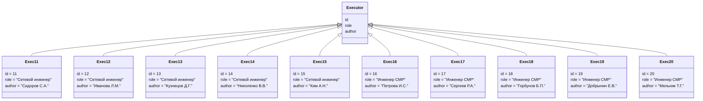

```mermaid
classDiagram
class Executor {
id
role
author
}

    class Exec11 {
        id = 11
        role = "Сетевой инженер"
        author = "Сидоров С.А."
    }
    class Exec12 {
        id = 12
        role = "Сетевой инженер"
        author = "Иванова Л.М."
    }
    class Exec13 {
        id = 13
        role = "Сетевой инженер"
        author = "Кузнецов Д.Г."
    }
    class Exec14 {
        id = 14
        role = "Сетевой инженер"
        author = "Николенко В.В."
    }
    class Exec15 {
        id = 15
        role = "Сетевой инженер"
        author = "Ким А.Н."
    }
    class Exec16 {
        id = 16
        role = "Инженер СМР"
        author = "Петрова И.С."
    }
    class Exec17 {
        id = 17
        role = "Инженер СМР"
        author = "Сергеев Р.А."
    }
    class Exec18 {
        id = 18
        role = "Инженер СМР"
        author = "Горбунов Б.П."
    }
    class Exec19 {
        id = 19
        role = "Инженер СМР"
        author = "Добрынин Е.В."
    }
    class Exec20 {
        id = 20
        role = "Инженер СМР"
        author = "Мельник Т.Г."
    }

    Executor <|-- Exec11
    Executor <|-- Exec12
    Executor <|-- Exec13
    Executor <|-- Exec14
    Executor <|-- Exec15
    Executor <|-- Exec16
    Executor <|-- Exec17
    Executor <|-- Exec18
    Executor <|-- Exec19
    Executor <|-- Exec20
```
