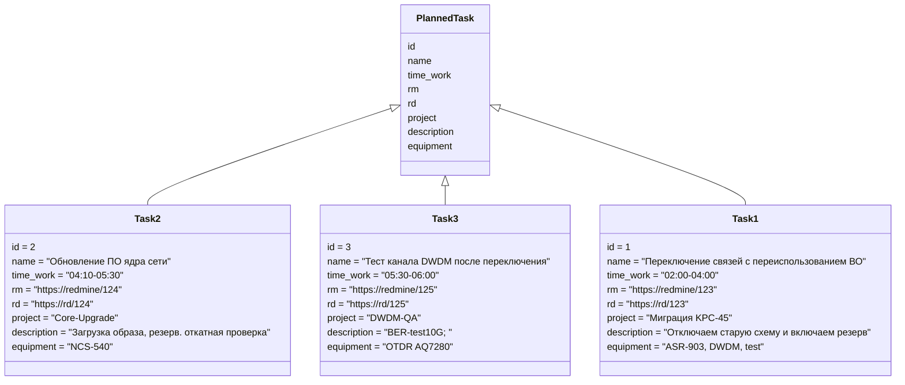

```mermaid
classDiagram
class PlannedTask {
id
name
time_work
rm
rd
project
description
equipment

}

    class Task2 {
        id = 2
        name = "Обновление ПО ядра сети"
        time_work = "04:10-05:30"
        rm = "https://redmine/124"
        rd = "https://rd/124"
        project = "Core-Upgrade"
        description = "Загрузка образа, резерв. откатная проверка"
        equipment = "NCS-540"
    }

    class Task3 {
        id = 3
        name = "Тест канала DWDM после переключения"
        time_work = "05:30-06:00"
        rm = "https://redmine/125"
        rd = "https://rd/125"
        project = "DWDM-QA"
        description = "BER-test10G; "
        equipment = "OTDR AQ7280"

    }

    class Task1 {
        id = 1
        name = "Переключение связей с переиспользованием ВО"
        time_work = "02:00-04:00"
        rm = "https://redmine/123"
        rd = "https://rd/123"
        project = "Миграция KPC-45"
        description = "Отключаем старую схему и включаем резерв"
        equipment = "ASR-903, DWDM, test"

    }

    PlannedTask <|-- Task2
    PlannedTask <|-- Task3
    PlannedTask <|-- Task1
```
