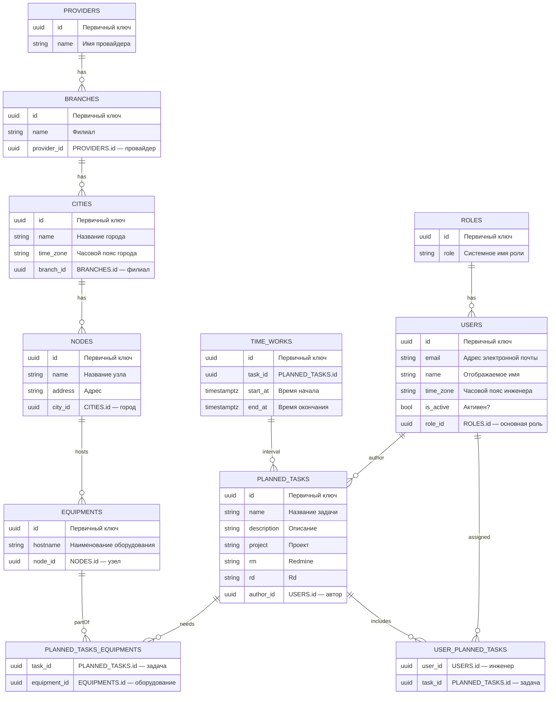

# Схема данных

---

- Одна задача (PLANNED_TASK.task_id) может иметь множество записей времени (TIME_WORK.time_work_id).\*

---

- Одна задача (PLANNED_TASK.task_id) может иметь множество оборудования (EQUIPMENT.equipment_id).

---

- Один провайдер (PROVIDER.provider_id) может иметь множество филиалов (BRANCH.branch_id).

---

- Один провайдер (PROVIDER.provider_id) может иметь множество оборудования (EQUIPMENT.equipment_id).

---

- Один филиал (BRANCH.branch_id) может иметь множество городов (CITY.city_id).

---

- Один филиал (BRANCH.branch_id) может иметь множество оборудования (EQUIPMENT.equipment_id).

---

- Один город (CITY.city_id) может иметь множество локаций (улиц) (LOCATION.street_id).

---

- Один город (CITY.city_id) может иметь множество оборудования (EQUIPMENT.equipment_id).

---

- Одна локация (улица) (LOCATION.street_id) может иметь множество оборудования (EQUIPMENT.equipment_id).

---

- Одна роль (ROLE.role) может быть у множества пользователей (USER.number).

---

- Одна роль (ROLE.role) может быть связана с множеством задач (PLANNED_TASK.task_id).

---

- Один пользователь (USER.number) может иметь множество задач (PLANNED_TASK.task_id).
