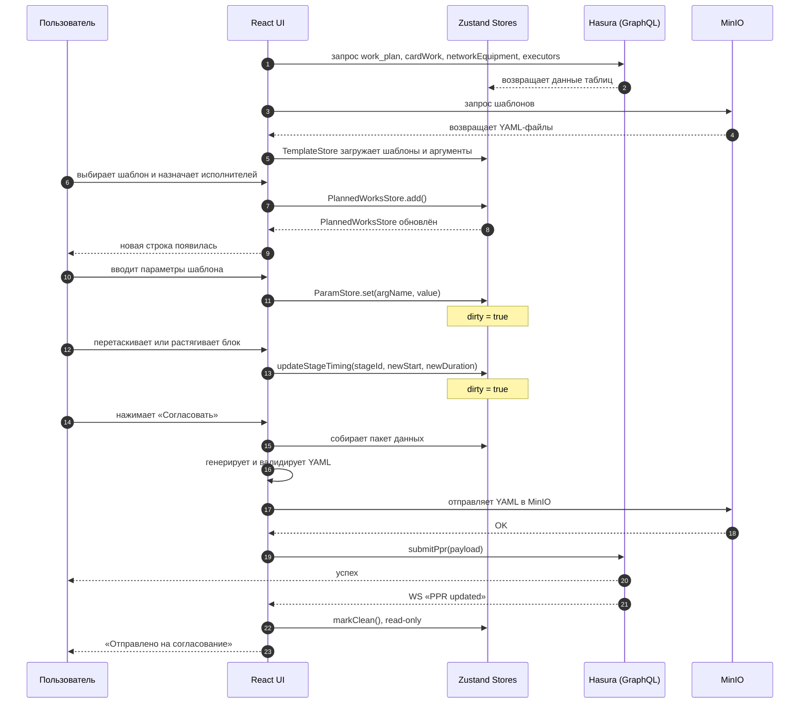

# Схема взаимодействия

```mermaid
sequenceDiagram
autonumber

    participant User as Пользователь
    participant UI   as React UI
    participant Store as Zustand Stores
    participant Hasura as Hasura (GraphQL)
    participant MinIO as MinIO

    %% ----- Начальная гидрация -----
    UI->>Hasura: запрос work_plan, cardWork, networkEquipment, executors
    Hasura-->>Store: возвращает данные таблиц
    UI->>MinIO: запрос шаблонов
    MinIO-->>UI: возвращает YAML-файлы
    UI->>Store: TemplateStore загружает шаблоны и аргументы

    %% ----- Шаг 1: выбор шаблона -----
    User->>UI: выбирает шаблон и назначает исполнителей
    UI->>Store: PlannedWorksStore.add()
    Store-->>UI: PlannedWorksStore обновлён
    UI-->>User: новая строка появилась

    %% ----- Шаг 2: ввод параметров -----
    User->>UI: вводит параметры шаблона
    UI->>Store: ParamStore.set(argName, value)
    Note over Store: dirty = true

    %% ----- Шаг 3: тайм-лайн -----
    User->>UI: перетаскивает или растягивает блок
    UI->>Store: updateStageTiming(stageId, newStart, newDuration)
    Note over Store: dirty = true

    %% ----- Финальное сохранение + экспорт YAML -----
    User->>UI: нажимает «Согласовать»
    UI->>Store: собирает пакет данных
    UI->>UI: генерирует и валидирует YAML
    UI->>MinIO: отправляет YAML в MinIO
    MinIO-->>UI: OK
    UI->>Hasura: submitPpr(payload)
    Hasura-->>User: успех
    Hasura-->>UI: WS «PPR updated»
    UI->>Store: markClean(), read-only
    UI-->>User: «Отправлено на согласование»
```
