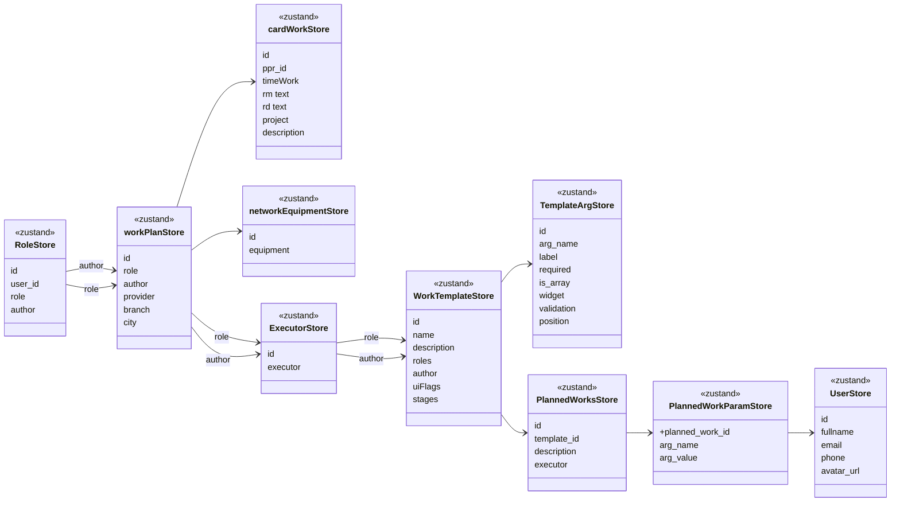

# Store

```mermaid
classDiagram
    direction LR
    class RoleStore {
        <<zustand>>
        id 
        user_id
        role 
        author
    }

    class workPlanStore {
        <<zustand>>
        id
        role 
        author
        provider 
        branch 
        city 
    }

    class cardWorkStore {
        <<zustand>>
        id
        ppr_id 
        timeWork
        rm text
        rd text
        project 
        description 
    }
    %% Оборудование
    class networkEquipmentStore {
        <<zustand>>
        id

        equipment 
    }
%% Исполнители
    class ExecutorStore {
        <<zustand>>
        id
        executor
    }

    %% ===== библиотека шаблонов =====
    class WorkTemplateStore {
        <<zustand>>
        id 
        name 
        description 
        roles 
        author
        uiFlags 
        stages 
    }

    class TemplateArgStore {
        <<zustand>>
        id 
        arg_name 
        label 
        required 
        is_array 
        widget 
        validation 
        position
    }


        class PlannedWorksStore {
        <<zustand>>
        id 
        template_id 
        description 
        executor
    }

    class PlannedWorkParamStore {
        <<zustand>>
        +planned_work_id 
        arg_name 
        arg_value 
    }
    
    %% ===== справочники =====
    class UserStore {
        <<zustand>>
        id 
        fullname 
        email 
        phone 
        avatar_url 
    }


    RoleStore --> workPlanStore : author
    RoleStore --> workPlanStore : role
    workPlanStore --> cardWorkStore
    workPlanStore --> networkEquipmentStore
    workPlanStore --> ExecutorStore: role
    workPlanStore --> ExecutorStore: author

    ExecutorStore --> WorkTemplateStore: role
    ExecutorStore --> WorkTemplateStore: author
    WorkTemplateStore --> TemplateArgStore
    WorkTemplateStore --> PlannedWorksStore
    PlannedWorksStore --> PlannedWorkParamStore
    PlannedWorkParamStore --> UserStore
```